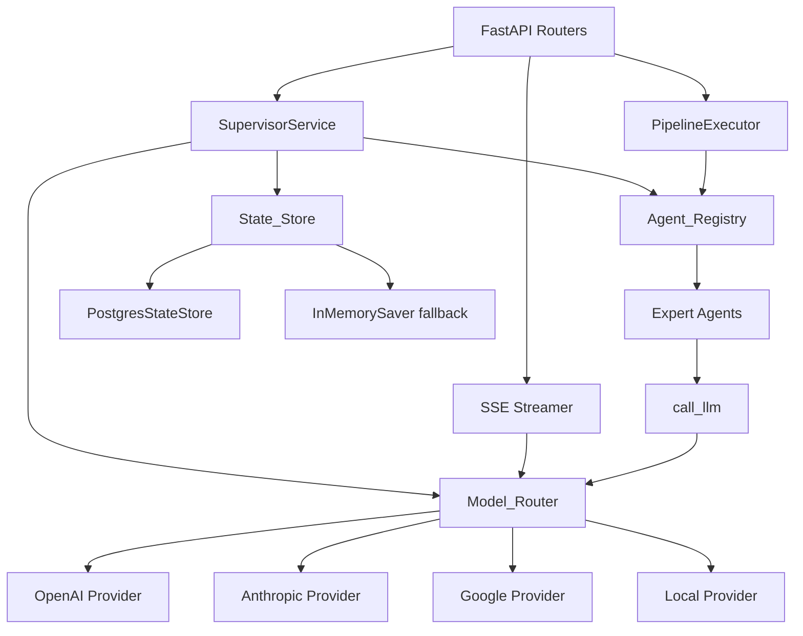

# Design Document

## Overview

이 설계 문서는 기존 24개 Tool Agent 중 유사 기능 에이전트를 5개 Expert Agent로 통합하고, call_llm 유틸리티 완성, Agent Pipeline, 영속 상태 관리, SSE 스트리밍, 멀티 모델 지원 기능을 추가하는 구현 방안을 정의한다.

## Architecture

### 디렉토리 구조 (신규/변경)

```
app/
├── framework/
│   ├── base.py              (변경 없음)
│   ├── pipeline.py          (신규: Pipeline_Executor)
│   ├── state_store.py       (신규: State_Store 인터페이스 + PostgreSQL 구현)
│   ├── model_router.py      (신규: Model_Router + LLM_Provider 인터페이스)
│   ├── streaming.py         (신규: SSE 스트리밍 유틸리티)
│   └── ...
├── tool_agents/
│   ├── _llm_utils.py        (수정: call_llm 완전 구현)
│   ├── sql_expert_agent/    (신규: 통합 SQL Expert)
│   ├── schema_expert_agent/ (신규: 통합 Schema Expert)
│   ├── communication_agent/ (신규: 통합 Communication)
│   ├── document_agent/      (신규: 통합 Document)
│   ├── planning_agent/      (신규: 통합 Planning)
│   ├── sql_formatter_agent/ (기존: deprecated=True 추가)
│   ├── sql_lint_agent/      (기존: deprecated=True 추가)
│   └── ...
├── agents/
│   ├── supervisor_router.py (수정: stream 엔드포인트 추가)
│   └── pipeline_router.py   (신규: Pipeline API 라우터)
└── services/
    └── llm.py               (기존 유지, Model_Router에서 참조)
```

### 컴포넌트 다이어그램

```
┌─────────────────────────────────────────────────────────┐
│                    FastAPI Layer                          │
│  /supervisor/chat  /supervisor/chat/stream  /supervisor/pipeline │
└───────────┬──────────────┬────────────────────┬─────────┘
            │              │                    │
            ▼              ▼                    ▼
┌───────────────┐  ┌──────────────┐  ┌─────────────────┐
│ SupervisorSvc │  │ SSE Streamer │  │ Pipeline_Executor│
│ (LangGraph)   │  │              │  │                  │
└───────┬───────┘  └──────┬───────┘  └────────┬────────┘
        │                  │                   │
        ▼                  ▼                   ▼
┌─────────────────────────────────────────────────────────┐
│                  Model_Router                             │
│  ┌─────────┐ ┌──────────┐ ┌────────┐ ┌───────┐        │
│  │ OpenAI  │ │Anthropic │ │ Google │ │ Local │        │
│  │Provider │ │Provider  │ │Provider│ │Provider│        │
│  └─────────┘ └──────────┘ └────────┘ └───────┘        │
└─────────────────────────────────────────────────────────┘
        │
        ▼
┌─────────────────────────────────────────────────────────┐
│               Agent_Registry (auto-discovery)            │
│  ┌────────────┐ ┌──────────────┐ ┌───────────────┐     │
│  │sql_expert  │ │schema_expert │ │communication  │ ... │
│  └────────────┘ └──────────────┘ └───────────────┘     │
└─────────────────────────────────────────────────────────┘
        │
        ▼
┌─────────────────────────────────────────────────────────┐
│                    State_Store                            │
│           PostgreSQL (sessions table)                     │
│         fallback → InMemorySaver                         │
└─────────────────────────────────────────────────────────┘
```

## Design Decisions

### D1: Expert Agent 내부 라우팅 패턴

**결정:** Expert Agent는 단일 Tool 클래스에서 `sub_command` 파라미터를 받아 내부 메서드로 라우팅한다.

**이유:** BaseToolFactory/BaseAgentTool 인터페이스를 변경하지 않고(스코프 경계), 단일 Tool이 여러 기능을 분기하는 것이 Registry 구조와 호환된다.

**비용:** sub_command별 args_schema 검증이 런타임에 수행되어야 한다.

**탈출구:** 향후 BaseAgentTool에 sub_command를 1급 개념으로 추가하여 정적 검증 지원.

### D2: Model_Router 위치

**결정:** app/framework/model_router.py에 독립 모듈로 배치. 기존 model.py의 create_chat_model은 내부적으로 Model_Router를 사용하도록 래핑.

**이유:** 기존 코드(supervisor.py, supervisor_router.py)가 create_chat_model을 호출하므로, 기존 인터페이스를 유지하면서 내부 구현만 교체한다.

**비용:** model.py에 대한 의존 그래프 변경 최소화를 위한 래핑 레이어 추가.

**탈출구:** 직접 Model_Router를 사용하도록 점진적 마이그레이션.

### D3: State_Store 구현 전략

**결정:** LangGraph의 PostgresSaver (langgraph-checkpoint-postgres) 패키지를 활용하되, 커스텀 TTL 관리 레이어를 추가한다.

**이유:** LangGraph 생태계와 호환되며, 체크포인터 인터페이스를 그대로 사용할 수 있다. 별도의 직렬화 로직을 작성하지 않아도 된다.

**비용:** langgraph-checkpoint-postgres 의존성 추가.

**탈출구:** 커스텀 BaseCheckpointSaver 구현으로 전환 가능.

### D4: SSE 스트리밍 구현

**결정:** FastAPI의 StreamingResponse + LangGraph의 astream_events 조합으로 구현한다.

**이유:** LangGraph가 이미 astream_events를 지원하므로 추가 인프라 없이 SSE를 구현할 수 있다. WebSocket 대비 구현 복잡도가 낮다.

**비용:** 양방향 통신이 필요한 경우 WebSocket으로 전환해야 한다.

**탈출구:** 향후 WebSocket 엔드포인트 추가 가능.

### D5: Pipeline Executor 설계

**결정:** Pipeline_Executor는 프레임워크 레벨 서비스로, Agent_Registry를 참조하여 각 step의 Tool을 생성하고 순차 실행한다.

**이유:** Supervisor 그래프와 독립적으로 동작하여, LLM 개입 없이 정의된 순서대로 Agent를 실행한다 (deterministic pipeline).

**비용:** LLM이 동적으로 판단하는 유연한 라우팅은 불가능 (그것은 기존 Supervisor가 담당).

**탈출구:** 향후 conditional step (조건부 분기)을 Pipeline_Definition에 추가 가능.

## Detailed Design

### 1. Expert Agent 공통 패턴

```python
# app/tool_agents/sql_expert_agent/tool.py (예시 구조)
class SqlExpertInput(BaseModel):
    sub_command: str = Field(..., description="format | lint | explain | analyze_slow_query")
    sql: str = Field(default="", description="SQL 쿼리 (format, lint용)")
    query: str = Field(default="", description="SQL 쿼리 (explain, analyze용)")
    analyze: bool = Field(default=False, description="EXPLAIN ANALYZE 여부")

class SqlExpertTool(BaseAgentTool):
    name: str = "sql_expert"
    args_schema = SqlExpertInput
    response_format = "content_and_artifact"

    _VALID_COMMANDS = {"format", "lint", "explain", "analyze_slow_query"}

    async def _arun(self, sub_command: str, **kwargs):
        if sub_command not in self._VALID_COMMANDS:
            return "", build_error_artifact(...)
        handler = getattr(self, f"_handle_{sub_command}")
        return await handler(**kwargs)
```

### 2. Model_Router 설계

```python
# app/framework/model_router.py
class LLMProvider(ABC):
    @abstractmethod
    async def ainvoke(self, messages: list, model: str,
                     temperature: float, max_tokens: int) -> str: ...

class ModelRouter:
    def __init__(self):
        self._providers: dict[str, LLMProvider] = {}

    def register_provider(self, name: str, provider: LLMProvider): ...

    def resolve(self, model_identifier: str) -> tuple[LLMProvider, str]:
        """'anthropic/claude-3-sonnet' → (AnthropicProvider, 'claude-3-sonnet')"""
        if "/" in model_identifier:
            provider_name, model_name = model_identifier.split("/", 1)
        else:
            provider_name, model_name = "openai", model_identifier
        ...

    async def ainvoke(self, model_identifier: str, messages: list, **kwargs) -> str: ...
```

### 3. call_llm 구현

```python
# app/tool_agents/_llm_utils.py
async def call_llm(
    system_prompt: str,
    user_input: str,
    model: str = "gpt-4o-mini",
    temperature: float = 0.0,
    max_tokens: int = 4096,
) -> str:
    if not system_prompt or not user_input:
        raise ValueError("system_prompt and user_input must be non-empty")
    router = get_model_router()
    messages = [
        SystemMessage(content=system_prompt),
        HumanMessage(content=user_input),
    ]
    return await router.ainvoke(model, messages, temperature=temperature, max_tokens=max_tokens)
```

### 4. Pipeline_Executor 설계

```python
# app/framework/pipeline.py
class PipelineStep(BaseModel):
    agent_type: str
    sub_command: str | None = None
    input_mapping: dict[str, str] = {}  # {"sql": "$.formatted_sql"}

class PipelineDefinition(BaseModel):
    steps: list[PipelineStep]  # max 10

class StepResult(BaseModel):
    step_index: int
    agent_type: str
    sub_command: str | None
    input_data: dict
    output_artifact: dict
    duration_ms: float
    status: str  # "success" | "failed"

class ExecutionTrace(BaseModel):
    pipeline_id: str
    steps: list[StepResult]
    total_duration_ms: float
    status: str  # "completed" | "failed" | "validation_error"

class PipelineExecutor:
    def __init__(self, registry: ToolAgentRegistry): ...
    async def execute(self, definition: PipelineDefinition) -> ExecutionTrace: ...
```

### 5. State_Store 설계

```python
# app/framework/state_store.py
class StateStore(ABC):
    @abstractmethod
    async def save_state(self, session_id: str, state: dict) -> None: ...
    @abstractmethod
    async def load_state(self, session_id: str) -> dict | None: ...
    @abstractmethod
    async def delete_state(self, session_id: str) -> None: ...
    @abstractmethod
    async def list_sessions(self, limit: int = 50, offset: int = 0) -> list[dict]: ...

class PostgresStateStore(StateStore):
    """PostgreSQL 기반 구현. sessions 테이블 사용."""
    ...

def get_checkpointer() -> BaseCheckpointSaver:
    """환경에 따라 PostgresSaver 또는 InMemorySaver 반환."""
    ...
```

### 6. SSE 스트리밍 설계

```python
# app/framework/streaming.py
class SSEEvent(BaseModel):
    event: str  # "token" | "tool_call" | "tool_result" | "done" | "error"
    data: dict
    timestamp: str

async def stream_supervisor_response(
    service: SupervisorService,
    query: str,
    config: dict,
) -> AsyncGenerator[str, None]:
    """LangGraph astream_events를 SSE 형식으로 변환."""
    ...
```

## Data Models

### sessions 테이블 (PostgreSQL)

```sql
CREATE TABLE IF NOT EXISTS sessions (
    session_id VARCHAR(64) PRIMARY KEY,
    state_json JSONB NOT NULL,
    created_at TIMESTAMPTZ NOT NULL DEFAULT NOW(),
    updated_at TIMESTAMPTZ NOT NULL DEFAULT NOW(),
    expires_at TIMESTAMPTZ NOT NULL DEFAULT NOW() + INTERVAL '24 hours'
);

CREATE INDEX idx_sessions_expires_at ON sessions (expires_at);
```

### Pipeline API 스키마

```json
// POST /supervisor/pipeline request body
{
  "steps": [
    {"agent_type": "sql_expert", "sub_command": "format", "input_mapping": {}},
    {"agent_type": "sql_expert", "sub_command": "explain", "input_mapping": {"query": "$.formatted_sql"}}
  ]
}
```

### SSE 이벤트 형식

```
event: token
data: {"content": "분석", "timestamp": "2024-01-01T00:00:00Z"}

event: tool_call
data: {"agent_type": "sql_expert", "sub_command": "explain", "timestamp": "..."}

event: tool_result
data: {"artifact": {...}, "timestamp": "..."}

event: done
data: {"full_response": "...", "session_id": "...", "tool_calls": [...]}
```

## Components and Interfaces

### Expert Agent 공통 인터페이스

모든 Expert Agent는 동일한 패턴을 따르며 다음 인터페이스를 구현한다:

```python
class ExpertAgentTool(BaseAgentTool):
    """Expert Agent 공통 기반 클래스"""
    name: str  # agent_type (e.g., "sql_expert")
    args_schema: type[BaseModel]  # sub_command + 도메인 입력 필드
    response_format: str = "content_and_artifact"

    _VALID_COMMANDS: set[str]  # 허용된 sub_command 집합

    async def _arun(self, sub_command: str, **kwargs) -> tuple[str, dict]:
        """sub_command 검증 → 입력 검증 → 핸들러 디스패치"""
        ...

class ExpertAgentFactory(BaseToolFactory):
    """Expert Agent 팩토리 공통 기반"""
    agent_type: str
    deprecated: bool = False
    def create_tool(self, tool_config: dict) -> BaseAgentTool: ...
```

### LLM_Provider 인터페이스

```python
class LLMProvider(ABC):
    """LLM 서비스 프로바이더 추상 인터페이스"""
    @abstractmethod
    async def ainvoke(
        self, messages: list, model: str,
        temperature: float, max_tokens: int,
        callbacks: list | None = None
    ) -> str: ...
```

### Model_Router 인터페이스

```python
class ModelRouter:
    """모델 식별자 → LLM_Provider 라우팅"""
    def register_provider(self, name: str, provider: LLMProvider) -> None: ...
    def replace_provider(self, name: str, provider: LLMProvider) -> None: ...
    def resolve(self, model_identifier: str) -> tuple[LLMProvider, str]: ...
    async def ainvoke(self, model_identifier: str, messages: list, **kwargs) -> str: ...
```

### State_Store 인터페이스

```python
class StateStore(ABC):
    """세션 상태 영속 저장소 인터페이스"""
    @abstractmethod
    async def save_state(self, session_id: str, state: dict) -> None: ...
    @abstractmethod
    async def load_state(self, session_id: str) -> dict | None: ...
    @abstractmethod
    async def delete_state(self, session_id: str) -> None: ...
    @abstractmethod
    async def list_sessions(self, limit: int = 50, offset: int = 0) -> list[dict]: ...
```

### Pipeline_Executor 인터페이스

```python
class PipelineExecutor:
    """파이프라인 정의를 받아 순차 실행하는 실행기"""
    def __init__(self, registry: ToolAgentRegistry): ...
    async def validate(self, definition: PipelineDefinition) -> list[str]: ...
    async def execute(self, definition: PipelineDefinition, initial_input: dict | None = None) -> ExecutionTrace: ...
```

### SSE Streaming 인터페이스

```python
async def stream_supervisor_response(
    service: SupervisorService,
    query: str,
    config: dict,
) -> AsyncGenerator[str, None]:
    """LangGraph astream_events를 SSE 형식으로 변환하여 yield"""
    ...
```

### call_llm 유틸리티 인터페이스

```python
async def call_llm(
    system_prompt: str,
    user_input: str,
    model: str = "gpt-4o-mini",
    temperature: float = 0.0,
    max_tokens: int = 4096,
) -> str:
    """통합 LLM 호출 유틸리티. Model_Router를 통해 적절한 프로바이더로 라우팅."""
    ...
```

### 컴포넌트 의존 관계



## Correctness Properties

*A property is a characteristic or behavior that should hold true across all valid executions of a system-essentially, a formal statement about what the system should do. Properties serve as the bridge between human-readable specifications and machine-verifiable correctness guarantees.*

### Property 1: Expert Agent Sub_Command 라우팅 및 입력 검증

*For any* Expert Agent (sql_expert, schema_expert, communication, document, planning) and *for any* string value as sub_command:
- If the sub_command is in the agent's valid set AND required input fields are present and non-empty, the agent SHALL return an artifact with type matching the agent type (not an error artifact)
- If the sub_command is NOT in the valid set, the agent SHALL return an error artifact containing the invalid sub_command and list of valid sub_commands
- If required input fields are missing or empty, the agent SHALL return an error artifact listing the missing fields without executing the main logic

**Validates: Requirements 1.7, 1.8, 1.9, 2.8, 2.9, 3.8, 3.9, 4.5, 4.8, 5.4, 5.7**

### Property 2: SQL Expert 서브커맨드 아티팩트 구조 정합성

*For any* valid SQL string:
- Invoking "format" SHALL return an artifact containing `formatted_sql` (str) and `original` (str where original equals the input SQL)
- Invoking "lint" SHALL return an artifact containing an `issues` list where each issue has `rule`, `severity` (∈ {"error", "warning"}), `message`, and `suggestion` fields

**Validates: Requirements 1.2, 1.3**

### Property 3: EXPLAIN ANALYZE는 SELECT 전용

*For any* SQL query string that does NOT start with SELECT (case-insensitive), invoking the sql_expert with sub_command "explain" and analyze=true SHALL return an error artifact indicating ANALYZE is restricted to SELECT queries only.

**Validates: Requirements 1.5**

### Property 4: Schema Expert DDL 생성 정합성

*For any* valid table_name (non-empty string) and columns (list of ColumnSpec), invoking "generate_ddl" SHALL produce an artifact where the DDL text contains:
- `CREATE TABLE {table_name}` statement
- `PRIMARY KEY` constraint for columns with primary_key=True
- `CREATE INDEX` statements for columns with unique=True

**Validates: Requirements 2.2**

### Property 5: Schema Expert Index Advisor 추출 정합성

*For any* SELECT query containing WHERE, JOIN, or ORDER BY clauses with column references, invoking "advise_index" SHALL return an artifact with a `recommendations` list where each recommendation's `columns` field references columns from those clauses.

**Validates: Requirements 2.5**

### Property 6: LLM 기반 Expert Agent 아티팩트 구조

*For any* LLM-dependent Expert Agent (communication, document, planning) with valid inputs and a mocked call_llm returning valid JSON:
- The returned artifact SHALL contain all required fields defined for that sub_command
- The artifact type SHALL match the agent type

**Validates: Requirements 3.2, 3.3, 3.4, 4.2, 4.3, 4.4, 5.2, 5.3**

### Property 7: LLM 호출 실패 시 에러 아티팩트 및 재시도 (Communication Agent)

*For any* Communication Agent sub_command with valid inputs, if call_llm raises an exception:
- The agent SHALL retry exactly once with the same parameters
- On second failure, the agent SHALL return an error artifact with type "communication", the sub_command, and the failure reason

**Validates: Requirements 3.6**

### Property 8: LLM JSON 파싱 실패 시 원본 텍스트 보존

*For any* LLM-dependent Expert Agent (communication, document, planning), if call_llm returns a string that cannot be parsed as valid JSON, the agent SHALL return an artifact where:
- The raw response text is included as the primary content field
- The artifact type is preserved as the agent type

**Validates: Requirements 3.7, 4.7, 5.6**

### Property 9: call_llm 파라미터 검증

*For any* call to call_llm:
- If system_prompt or user_input is empty or contains only whitespace, it SHALL raise ValueError
- If temperature is outside [0.0, 2.0], it SHALL raise ValueError
- If max_tokens is outside [1, 128000], it SHALL raise ValueError
- If inputs are valid, it SHALL return a non-empty string OR raise RuntimeError (provider failure)

**Validates: Requirements 6.1, 6.6, 6.8, 6.9, 6.10**

### Property 10: Model_Router 라우팅 결정론성

*For any* model identifier string:
- If it contains "/", the Model_Router SHALL split on the first "/" and use the prefix (case-insensitive) as provider key and the remainder as model name, consistently on repeated calls
- If it does NOT contain "/", it SHALL route to the "openai" provider with the full string as model name
- Provider name lookup SHALL be case-insensitive ("OpenAI", "OPENAI", "openai" resolve identically)

**Validates: Requirements 10.3, 10.4, 10.10**

### Property 11: Model_Router 프로바이더 레지스트리 관리

*For any* provider name and LLM_Provider instance:
- After register_provider(name, provider), the provider SHALL be routable via that name
- If the provider name is already registered, register_provider SHALL raise ValueError
- If a provider name is not found during routing, resolve SHALL raise ValueError containing the requested name and list of registered providers
- Provider-specific exceptions from ainvoke SHALL be wrapped in RuntimeError with provider name, model name, and original error

**Validates: Requirements 10.6, 10.7, 10.11, 10.12**

### Property 12: Pipeline Execution Trace 완전성

*For any* pipeline of N steps (1 ≤ N ≤ 10):
- If all steps succeed, the Execution_Trace SHALL contain exactly N StepResults with status "success" and total_duration_ms ≥ sum of individual durations
- If step K fails (1 ≤ K ≤ N), the Execution_Trace SHALL contain exactly K StepResults where the last has status "failed" and overall trace status is "failed"

**Validates: Requirements 7.3, 7.4**

### Property 13: Pipeline input_mapping 해석

*For any* pipeline step with input_mapping referencing fields from the previous step's artifact:
- The executor SHALL resolve each mapping expression to the corresponding value in the previous artifact
- If the first step has input_mapping, it SHALL resolve from the initial_input data
- If a referenced field does not exist in the source, the executor SHALL halt with an error indicating the missing field name and step index

**Validates: Requirements 7.2, 7.9, 7.11**

### Property 14: Pipeline 사전 검증

*For any* PipelineDefinition:
- If steps array is empty, validation SHALL fail indicating at least one step is required
- If steps count exceeds 10, validation SHALL fail indicating the maximum
- If any step references an agent_type not in the Agent_Registry, validation SHALL fail with the list of missing agent_types

**Validates: Requirements 7.5, 7.8, 7.10**

### Property 15: State_Store 영속성 라운드트립

*For any* valid session_id (alphanumeric, hyphens, underscores, ≤64 chars) and any serializable state dict:
- save_state followed by load_state with the same session_id SHALL return a state equivalent to the saved state
- save_state called twice with the same session_id SHALL result in a single record with the most recent state (UPSERT)
- LangChain messages in state SHALL be preserved through serialization/deserialization round-trip

**Validates: Requirements 8.4, 8.8, 8.10**

### Property 16: State_Store session_id 검증

*For any* string that is empty, exceeds 64 characters, or contains characters outside [a-zA-Z0-9\-\_], the State_Store SHALL raise ValueError.

**Validates: Requirements 8.11**

### Property 17: State_Store TTL 및 페이지네이션

*For any* save_state call, the resulting record's expires_at SHALL equal approximately current_time + configured TTL.
*For any* list_sessions call with valid limit (1-100) and offset (≥0), results SHALL be ordered by updated_at descending with count ≤ limit.

**Validates: Requirements 8.7, 8.9**

### Property 18: SSE 이벤트 형식 및 순서

*For any* SSE event emitted by the stream:
- The format SHALL be "event: {event_type}\ndata: {json_payload}\n\n" where event_type ∈ {token, tool_call, tool_result, done, error}
- Token events SHALL contain `content` (str) and `timestamp` (ISO 8601) fields
- Error events SHALL contain `error_message` (without stack traces) and `error_type` fields
- The last event SHALL always be either "done" or "error"

**Validates: Requirements 9.3, 9.4, 9.6, 9.7**

## Error Handling

### Expert Agent 에러 처리 패턴

모든 Expert Agent는 `auto_error_artifact` 데코레이터와 명시적 검증을 조합하여 에러를 처리한다:

1. **Sub_Command 검증 실패**: 허용되지 않은 sub_command → 에러 아티팩트 (valid sub_commands 목록 포함)
2. **입력 필드 검증 실패**: 필수 필드 누락/빈값 → 에러 아티팩트 (missing fields 목록 포함)
3. **데이터베이스 연결 실패**: SQL/Schema Expert의 DB 의존 기능 → `database_unavailable` 에러 아티팩트
4. **LLM 호출 실패**: Communication Agent는 1회 재시도 후 실패 시 에러 아티팩트, Document/Planning Agent는 즉시 에러 아티팩트
5. **LLM 응답 파싱 실패**: JSON 파싱 불가 시 raw text를 content로 사용 (에러가 아닌 graceful degradation)
6. **예상치 못한 예외**: `auto_error_artifact` 데코레이터가 포착하여 표준 에러 아티팩트로 변환

### call_llm 에러 처리

| 상황 | 동작 |
|------|------|
| system_prompt/user_input 빈값 | ValueError 즉시 raise |
| temperature/max_tokens 범위 초과 | ValueError 즉시 raise |
| 프로바이더 예외 (인증, rate limit 등) | RuntimeError로 래핑 (모델명, 프로바이더명, 원본 에러 포함) |
| 120초 타임아웃 | TimeoutError raise |

### Model_Router 에러 처리

| 상황 | 동작 |
|------|------|
| 미등록 프로바이더 요청 | ValueError (요청된 이름 + 등록된 프로바이더 목록) |
| API 키 미설정 | ConfigurationError at registration (환경변수명 + 프로바이더명) |
| 중복 프로바이더 등록 | ValueError (이미 등록된 이름) |
| 프로바이더 내부 에러 | RuntimeError 래핑 (프로바이더, 모델, 원본 에러 타입/메시지) |

### Pipeline_Executor 에러 처리

| 상황 | 동작 |
|------|------|
| 빈 steps 배열 | 검증 에러 (HTTP 422) |
| steps > 10 | 검증 에러 (HTTP 422) |
| 미등록 agent_type | 검증 에러 + 누락 타입 목록 (HTTP 422) |
| step 실행 실패 | 즉시 중단, Execution_Trace에 failed step 기록 |
| input_mapping 필드 부재 | 즉시 중단, 에러에 missing field + step index 포함 |
| 초기 입력 없이 첫 step에서 매핑 참조 | 에러 (missing initial input) |

### State_Store 에러 처리

| 상황 | 동작 |
|------|------|
| DB 연결 불가/타임아웃 (5초) | InMemorySaver 폴백 + 경고 로깅 + 응답에 "state_persistence": "in_memory" |
| 잘못된 session_id 형식 | ValueError raise |
| 만료된 세션 | load_state에서 None 반환 (주기적 cleanup이 삭제) |

### SSE 스트리밍 에러 처리

| 상황 | 동작 |
|------|------|
| LLM 생성 중 에러 | "error" 이벤트 emit (error_type: "llm_error") + 연결 종료 |
| Tool 실행 에러 | "error" 이벤트 emit (error_type: "tool_error") + 연결 종료 |
| 60초 토큰 타임아웃 | "error" 이벤트 emit (error_type: "timeout") + 연결 종료 |
| 클라이언트 연결 끊김 | 5초 내 감지 → LLM 생성 중단 + 리소스 해제 |
| 프록시 타임아웃 방지 | 15초 간격 heartbeat (": heartbeat\n\n") |

## Testing Strategy

### 테스트 프레임워크

- **Unit Tests / Property Tests**: pytest + hypothesis (Python property-based testing)
- **Integration Tests**: pytest + httpx (FastAPI TestClient)
- **Mocking**: unittest.mock / pytest-mock (call_llm, DB 연결 등)

### Property-Based Testing (PBT) 설정

이 프로젝트는 순수 함수적 로직과 입력 검증이 다수 존재하므로 PBT가 적합하다.

- **라이브러리**: hypothesis
- **최소 반복 횟수**: 100 iterations per property
- **태그 형식**: `# Feature: agent-consolidation-advanced, Property {N}: {title}`

### 테스트 분류

#### Property-Based Tests (hypothesis)

| Property | 대상 | 전략 |
|----------|------|------|
| P1: Sub_Command 라우팅 | 모든 Expert Agent | 랜덤 문자열로 sub_command 검증, 유효/무효 분기 확인 |
| P2: SQL 아티팩트 구조 | sql_expert | 랜덤 SQL 생성 → format/lint 결과 구조 검증 |
| P3: EXPLAIN SELECT 전용 | sql_expert | 비-SELECT 쿼리 생성 → 에러 확인 |
| P4: DDL 생성 | schema_expert | 랜덤 ColumnSpec → DDL 구조 검증 |
| P5: Index Advisor | schema_expert (mocked DB) | 랜덤 SELECT 쿼리 → recommendations 검증 |
| P6: LLM 아티팩트 구조 | communication/document/planning | Mocked call_llm + 랜덤 입력 → 구조 검증 |
| P7: LLM 재시도 | communication | Mocked 실패 → 재시도 횟수 검증 |
| P8: JSON 파싱 실패 대응 | LLM agents | Mocked non-JSON 응답 → raw text 보존 |
| P9: call_llm 검증 | _llm_utils.py | 랜덤 파라미터로 범위/빈값 검증 |
| P10: Model_Router 라우팅 | model_router.py | 랜덤 모델 ID → 라우팅 결과 검증 |
| P11: 프로바이더 관리 | model_router.py | 등록/중복/미등록 시나리오 |
| P12: Pipeline Trace | pipeline.py | 랜덤 N-step 파이프라인 → trace 완전성 |
| P13: Pipeline input_mapping | pipeline.py | 랜덤 매핑 식 → 해석 결과 검증 |
| P14: Pipeline 사전 검증 | pipeline.py | 빈/초과/미등록 검증 |
| P15: State_Store 라운드트립 | state_store.py | 랜덤 state 저장→로드 동등성 |
| P16: session_id 검증 | state_store.py | 랜덤 유효/무효 ID 검증 |
| P17: TTL/페이지네이션 | state_store.py | 랜덤 세션 생성 → 정렬/제한 검증 |
| P18: SSE 형식 | streaming.py | 랜덤 이벤트 → 포맷 검증 |

#### Example-Based Unit Tests

- Expert Agent 팩토리 `deprecated` 플래그 확인 (Req 1.12, 2.10, 3.10)
- call_llm 기본 파라미터 적용 확인 (Req 6.2, 6.5)
- Model_Router CostTrackingCallback 전달 확인 (Req 10.5)
- Pipeline metrics 기록 확인 (Req 7.6)
- State_Store 미존재 세션 로드 시 None 반환 (Req 8.5)

#### Integration Tests

- SQL Expert explain/analyze_slow_query with test DB (Req 1.4, 1.6, 1.10)
- Schema Expert inspect_schema/generate_er_diagram with test DB (Req 2.3, 2.4, 2.7)
- POST /supervisor/pipeline endpoint (Req 7.7)
- POST /supervisor/chat/stream SSE endpoint (Req 9.1, 9.2, 9.5)
- State_Store PostgreSQL 폴백 동작 (Req 8.6)
- SSE 클라이언트 disconnect 처리 (Req 9.8)
- SSE heartbeat 및 timeout (Req 9.9, 9.10)
- Model_Router API 키 미설정 시 ConfigurationError (Req 10.8)

#### Smoke Tests

- 모든 Expert Agent가 Agent_Registry에 등록됨 (Req 1.1, 2.1, 3.1, 4.1, 5.1)
- call_llm이 async function임 (Req 6.7)
- LLM_Provider 인터페이스 메서드 시그니처 확인 (Req 10.2)
- OpenAI가 기본 프로바이더로 등록됨 (Req 10.9)
- sessions 테이블 스키마 확인 (Req 8.2)
