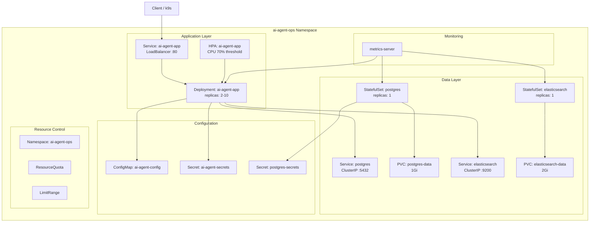
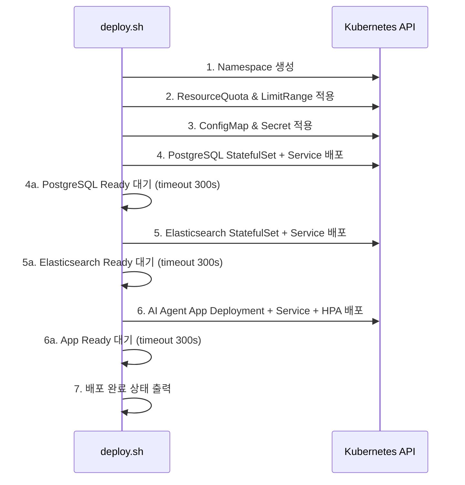

# Design Document: k8s-deployment

## Overview

AI Agent Ops 플랫폼을 Kubernetes에 배포하기 위한 기술 설계입니다. 기존 Docker Compose 기반 운영에서 Kubernetes 기반 오케스트레이션으로 전환하여, Pod 자동 복구, 수평 자동 스케일링, 무중단 배포, 그리고 k9s를 통한 실시간 모니터링을 달성합니다.

### 핵심 설계 결정

| 결정 항목 | 선택 | 근거 |
|-----------|------|------|
| 매니페스트 관리 도구 | Kustomize | kubectl 내장, 별도 설치 불필요, 환경별 오버레이 지원 |
| 의존 서비스 배포 방식 | StatefulSet + PVC | 데이터 영속성 보장, Pod 순서 보장 |
| 외부 접근 방식 | LoadBalancer (Docker Desktop) | 로컬 개발 환경에서 가장 단순한 외부 접근 방법 |
| 배포 자동화 | Bash 스크립트 | 의존성 최소화, 순차 실행 및 상태 확인 용이 |
| 이미지 최적화 | 멀티스테이지 빌드 | 최종 이미지 크기 최소화 (500MB 이하) |

## Architecture

### 전체 배포 아키텍처



### 배포 순서



## Components and Interfaces

### 디렉토리 구조

```
k8s/
├── base/                          # 공통 매니페스트 (Kustomize base)
│   ├── kustomization.yaml
│   ├── namespace.yaml             # Namespace 정의
│   ├── resource-quota.yaml        # ResourceQuota
│   ├── limit-range.yaml           # LimitRange
│   ├── configmap.yaml             # 비민감 환경 변수
│   ├── secret.yaml                # 민감 환경 변수 (template)
│   ├── deployment.yaml            # AI Agent App Deployment
│   ├── service.yaml               # AI Agent App Service (ClusterIP)
│   ├── hpa.yaml                   # HorizontalPodAutoscaler
│   ├── postgres/
│   │   ├── statefulset.yaml       # PostgreSQL StatefulSet
│   │   ├── service.yaml           # PostgreSQL Service
│   │   └── secret.yaml            # PostgreSQL credentials
│   └── elasticsearch/
│       ├── statefulset.yaml       # Elasticsearch StatefulSet
│       └── service.yaml           # Elasticsearch Service
├── overlays/
│   ├── dev/                       # 개발 환경 오버레이
│   │   ├── kustomization.yaml
│   │   ├── deployment-patch.yaml  # replica: 2, 작은 리소스
│   │   ├── service-patch.yaml     # LoadBalancer 타입
│   │   └── configmap-patch.yaml   # DEBUG_MODE=true
│   └── prod/                      # 운영 환경 오버레이
│       ├── kustomization.yaml
│       ├── deployment-patch.yaml  # replica: 3, 큰 리소스
│       └── configmap-patch.yaml   # LOG_LEVEL=WARNING
├── scripts/
│   └── deploy.sh                  # 배포 자동화 스크립트
└── .dockerignore                  # Docker 빌드 컨텍스트 제외 목록
```

### 컴포넌트 상세

#### 1. Docker 이미지 (멀티스테이지 빌드)

```dockerfile
# Stage 1: 의존성 설치
FROM python:3.13-slim AS builder
WORKDIR /build
COPY requirements.txt .
RUN pip install --no-cache-dir --prefix=/install -r requirements.txt

# Stage 2: 최종 이미지
FROM python:3.13-slim
WORKDIR /app
COPY --from=builder /install /usr/local
COPY . .
EXPOSE 8000
CMD ["uvicorn", "app.main:app", "--host", "0.0.0.0", "--port", "8000"]
```

#### 2. Deployment 매니페스트

주요 설정:
- `replicas: 2` (기본값, HPA가 관리)
- `strategy: RollingUpdate` (maxSurge: 1, maxUnavailable: 0)
- `readinessProbe`: HTTP GET /health:8000, initialDelay 10s, period 5s, failureThreshold 3
- `livenessProbe`: HTTP GET /health:8000, initialDelay 15s, period 10s, failureThreshold 3
- `resources.requests`: CPU 250m, Memory 256Mi
- `resources.limits`: CPU 1000m, Memory 512Mi
- 환경 변수: ConfigMap(envFrom) + Secret(envFrom) + optional Secret keys

#### 3. Service 매니페스트

- Base: ClusterIP 타입, port 80 → targetPort 8000, name "http"
- Dev overlay: LoadBalancer 타입으로 패치하여 localhost:80 접근
- Selector: `app: ai-agent-app, component: api`

#### 4. HPA (Horizontal Pod Autoscaler)

- `minReplicas: 2`, `maxReplicas: 10`
- Target: CPU averageUtilization 70%
- `behavior.scaleDown.stabilizationWindowSeconds: 300`

#### 5. 배포 스크립트 (deploy.sh)

인터페이스:
```bash
./k8s/scripts/deploy.sh <env>   # env: dev | prod
```

동작:
1. kubectl 연결 확인 (실패 시 즉시 종료)
2. Kustomize로 환경별 매니페스트 렌더링
3. 순차 배포 + 각 단계 Ready 확인 (timeout 300s)
4. 각 단계 진행 상태를 stdout으로 출력
5. 실패 시 에러 메시지를 stderr로 출력 (이전 단계 롤백하지 않음)

## Data Models

### Kubernetes 리소스 라벨 스키마

모든 리소스에 적용되는 공통 라벨:

| 라벨 키 | 설명 | 예시 값 |
|---------|------|---------|
| `app` | 애플리케이션 식별자 | `ai-agent-ops` |
| `component` | 컴포넌트 역할 | `api`, `database`, `search` |
| `version` | 이미지 버전 | `v1.0.0` |

### Pod Annotation 스키마

| Annotation 키 | 설명 | 형식 |
|---------------|------|------|
| `deploy-timestamp` | 배포 시각 | ISO 8601 (`2024-01-15T09:30:00Z`) |
| `app-version` | 앱 버전 | 시맨틱 버전 (`v1.0.0`) |

### ConfigMap 데이터 모델

| 키 | 기본값 | 허용값 | 설명 |
|----|--------|--------|------|
| `LOG_LEVEL` | `INFO` | `DEBUG\|INFO\|WARNING\|ERROR` | 로그 레벨 |
| `DEBUG_MODE` | `false` | `true\|false` | 디버그 모드 |
| `SESSION_TTL_HOURS` | `24` | 양의 정수 | 세션 만료 시간 |

### Secret 데이터 모델

| 키 | 필수 여부 | 설명 |
|----|-----------|------|
| `OPENAI_API_KEY` | 필수 | OpenAI API 인증 키 |
| `DATABASE_URL` | 필수 | PostgreSQL 연결 문자열 |
| `ELASTICSEARCH_URL` | 필수 | Elasticsearch 연결 URL |
| `ANTHROPIC_API_KEY` | 선택 | Anthropic API 키 |
| `GOOGLE_API_KEY` | 선택 | Google API 키 |

### PostgreSQL Secret 데이터 모델

| 키 | 설명 |
|----|------|
| `POSTGRES_DB` | 데이터베이스 이름 |
| `POSTGRES_USER` | 데이터베이스 사용자 |
| `POSTGRES_PASSWORD` | 데이터베이스 비밀번호 |

## Correctness Properties

*A property is a characteristic or behavior that should hold true across all valid executions of a system — essentially, a formal statement about what the system should do. Properties serve as the bridge between human-readable specifications and machine-verifiable correctness guarantees.*

### PBT 적용 불가 설명

이 기능은 Infrastructure as Code(Kubernetes 매니페스트, Kustomize 오버레이, 배포 셸 스크립트)가 핵심입니다. IaC는 선언적 구성이며 입력/출력을 가진 순수 함수가 아니므로, property-based testing은 적합하지 않습니다. 대신 아래의 정적 분석 및 dry-run 검증 가능한 정확성 속성을 정의합니다.

### Property 1: 매니페스트 스키마 유효성

*For any* Kubernetes 매니페스트 파일 in the k8s/ 디렉토리, `kubectl apply --dry-run=client` 실행 시 유효한 API 오브젝트로 인식되어야 한다.

**Validates: Requirements 2.1, 2.2, 3.1, 3.2, 5.1, 5.2, 6.1**

### Property 2: 라벨-셀렉터 일치성

*For any* Service 리소스의 selector 라벨 집합은, 해당 Service가 대상으로 하는 Deployment 또는 StatefulSet의 Pod template 라벨 집합의 부분집합이어야 한다.

**Validates: Requirements 3.1, 3.5**

### Property 3: 환경 변수 참조 무결성

*For any* Deployment/StatefulSet에서 envFrom 또는 env.valueFrom으로 참조하는 ConfigMap 키와 Secret 키는, 동일 네임스페이스 내에 정의된 ConfigMap/Secret 리소스에 실제로 존재해야 한다.

**Validates: Requirements 2.6, 4.1, 4.2, 5.4**

### Property 4: Kustomize 오버레이 렌더링 정합성

*For any* 환경(dev, prod), `kustomize build overlays/<env>` 실행 결과는 유효한 Kubernetes 매니페스트를 생성하며, base에 정의된 모든 리소스가 출력에 포함되어야 한다.

**Validates: Requirements 8.2**

### Property 5: 리소스 제한 범위 준수

*For any* Pod spec에 정의된 resources.requests와 resources.limits 값은 네임스페이스의 LimitRange 범위 이내이며, 전체 리소스 합계는 ResourceQuota를 초과하지 않아야 한다.

**Validates: Requirements 6.3, 6.4, 6.5**

### Property 6: 네임스페이스 격리

*For any* k8s/ 디렉토리 내의 리소스 매니페스트에서, metadata.namespace 값은 "ai-agent-ops"이거나 Kustomize에 의해 해당 네임스페이스로 설정되어야 한다.

**Validates: Requirements 6.1, 6.2**

### Property 7: 배포 순서 의존성

*For any* 배포 스크립트 실행에서, PostgreSQL과 Elasticsearch의 Ready 상태가 확인된 후에만 AI Agent App Deployment가 적용되어야 한다.

**Validates: Requirements 8.1**

### 검증 방법

위 속성들은 property-based testing이 아닌 다음 방법으로 검증합니다:

| 속성 | 검증 방법 |
|------|-----------|
| Property 1 | `kubectl apply --dry-run=client -f` 실행 |
| Property 2 | 매니페스트 파싱 후 라벨 교차 검증 스크립트 |
| Property 3 | Kustomize 렌더링 결과에서 참조 키 존재 확인 |
| Property 4 | `kustomize build` 성공 여부 + 리소스 카운트 검증 |
| Property 5 | 렌더링된 매니페스트의 리소스 값 합산 검증 |
| Property 6 | 모든 매니페스트의 namespace 필드 grep 검증 |
| Property 7 | 배포 스크립트 로그에서 순서 확인 (통합 테스트) |

## Error Handling

### Docker 빌드 에러

| 에러 상황 | 동작 |
|-----------|------|
| 의존성 설치 실패 | stderr 출력, 비정상 종료 코드 반환 |
| Dockerfile 문법 오류 | Docker CLI 에러 메시지 출력 |

### 배포 스크립트 에러

| 에러 상황 | 동작 |
|-----------|------|
| kubectl 클러스터 연결 실패 | 에러 메시지 출력, 배포 미시작 |
| 리소스 300s 내 Ready 미달 | 실패 단계명 + 에러를 stderr 출력, 이전 단계 유지 |
| 유효하지 않은 환경 인자 | 사용법 출력, 종료 |

### Kubernetes 런타임 에러

| 에러 상황 | 동작 |
|-----------|------|
| 필수 Secret 누락 | Pod CreateContainerConfigError 상태 |
| readinessProbe 3회 연속 실패 | Pod를 Service endpoint에서 제거 |
| livenessProbe 3회 연속 실패 | Pod 재시작 |
| ResourceQuota 초과 | Pod 생성 거부, 쿼터 초과 에러 |
| PV 데이터 보존 | reclaimPolicy: Retain으로 비정상 종료 시 데이터 유지 |

### 애플리케이션 에러 로깅

에러 발생 시 JSON 로그 필드:
```json
{
  "timestamp": "2024-01-15T09:30:00",
  "level": "ERROR",
  "message": "Request processing failed",
  "logger": "app.main",
  "error_type": "DatabaseConnectionError",
  "trace_id": "abc-123-def"
}
```

## Testing Strategy

### PBT 적용 여부 판단

이 기능은 **Infrastructure as Code (Kubernetes 매니페스트, Kustomize 오버레이, 배포 셸 스크립트)**가 핵심입니다. PBT(Property-Based Testing)는 다음 이유로 적합하지 않습니다:

- Kubernetes 매니페스트는 선언적 구성(declarative configuration)이며, 입력/출력을 가진 함수가 아님
- 배포 스크립트는 외부 시스템(kubectl, Kubernetes API)과의 상호작용이 핵심
- 테스트 대상이 "우리 코드의 로직"이 아닌 "인프라 구성의 정확성"

따라서 **스키마 검증, 스모크 테스트, 통합 테스트** 전략을 사용합니다.

### 테스트 계층

#### 1. 매니페스트 유효성 검증 (Static Analysis)

- `kubectl --dry-run=client`로 YAML 문법 및 API 스키마 검증
- Kustomize `kustomize build` 결과 검증
- 환경별 오버레이 렌더링 결과 비교

**검증 항목:**
- 모든 YAML 파일이 유효한 Kubernetes API 오브젝트인지 확인
- 라벨/셀렉터 일치 여부 확인
- 리소스 요청/제한 값이 명세와 일치하는지 확인
- ConfigMap/Secret 키가 Deployment에서 참조하는 키와 일치하는지 확인

#### 2. Docker 이미지 스모크 테스트

- 이미지 빌드 성공 여부
- 이미지 크기 500MB 이하 확인
- 컨테이너 실행 후 /health 엔드포인트 HTTP 200 응답 확인
- .dockerignore에 의한 불필요 파일 제외 확인

#### 3. 배포 스크립트 단위 테스트

- 환경 인자 파싱 검증 (dev/prod 외 입력 시 에러)
- kubectl 연결 확인 로직 검증
- 각 단계 순서 및 타임아웃 처리 검증
- stdout/stderr 출력 형식 검증

#### 4. 통합 테스트 (로컬 Kubernetes 클러스터)

Docker Desktop Kubernetes 또는 kind 클러스터에서:
- 전체 배포 스크립트 실행 후 모든 Pod Running 상태 확인
- /health 엔드포인트 접근 가능 여부
- HPA 동작 확인 (CPU 부하 주입 시 스케일 아웃)
- 무중단 배포 확인 (롤링 업데이트 중 요청 실패 없음)
- k9s에서 라벨 필터링, 메트릭 조회 가능 여부

#### 5. 장애 시나리오 테스트

- 필수 Secret 누락 시 Pod CreateContainerConfigError 상태 확인
- readinessProbe 실패 시 Service endpoint 제거 확인
- livenessProbe 실패 시 Pod 재시작 확인
- Pod 비정상 종료 후 PVC 데이터 유지 확인
- ResourceQuota 초과 시 Pod 생성 거부 확인
